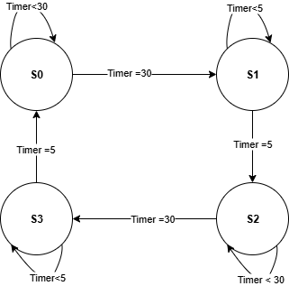
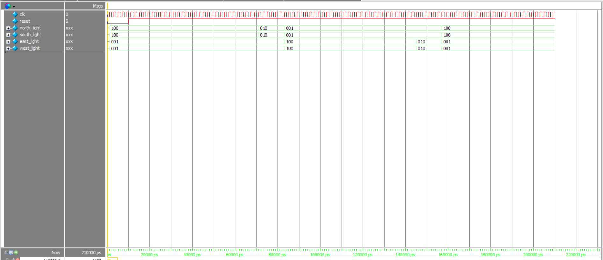

# Traffict-light-FSM-
Verilog implementation of a traffic light controller with FSM.
##  Overview
This project implements a traffic light controller using Verilog HDL.  
It is based on a **Finite State Machine (FSM)** model that controls the lights for four directions: North, South, East, and West.

##  Features
- FSM-based state transition for traffic lights
- Supports reset and clock input
- Four-direction control (North, South, East, West)

##  Tech Stack
- Verilog HDL
- Simulation: ModelSim 

## Demo
- FSM diagram
  
- Waveform

##  Project Structure

traffic_light.v # Main Verilog code

traffic_light_tb.v # Testbench

README.md # Documentation
